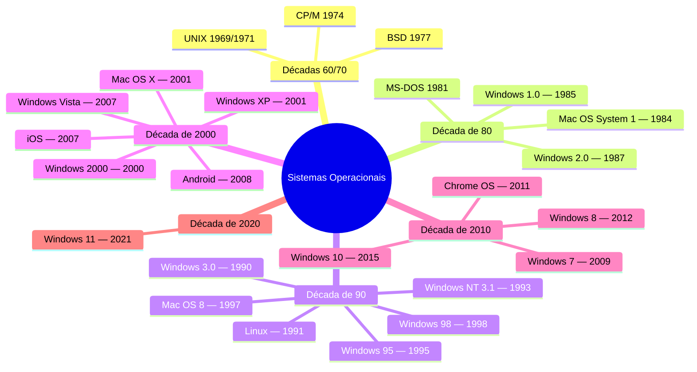
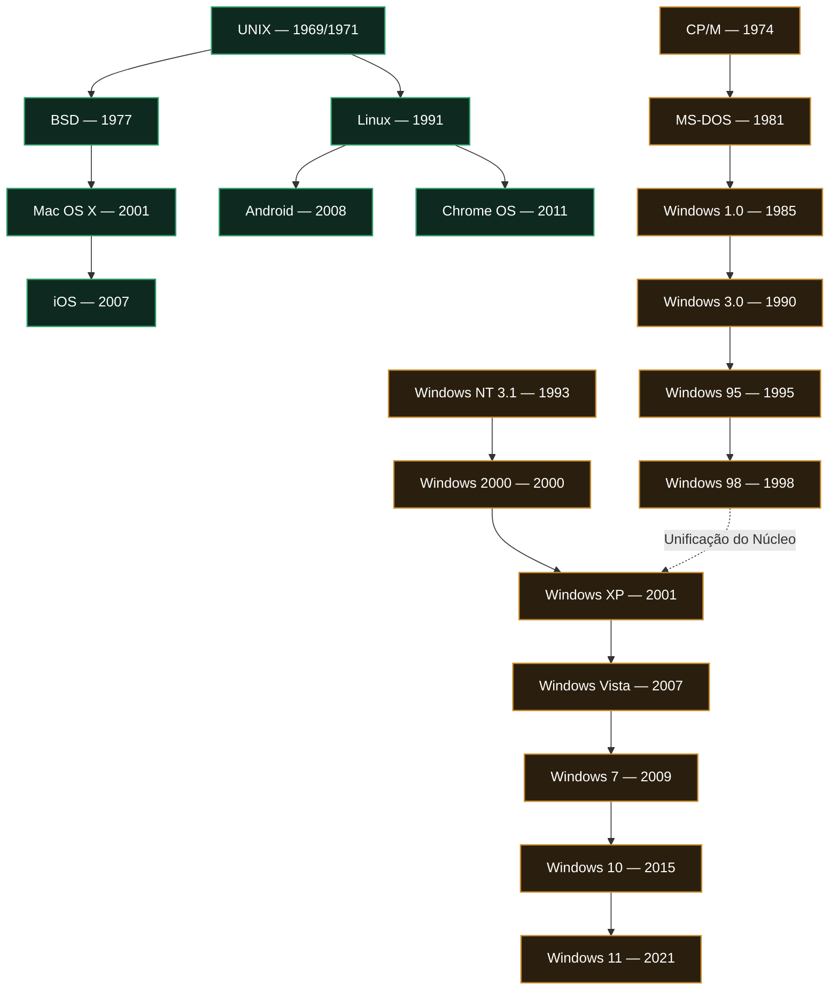
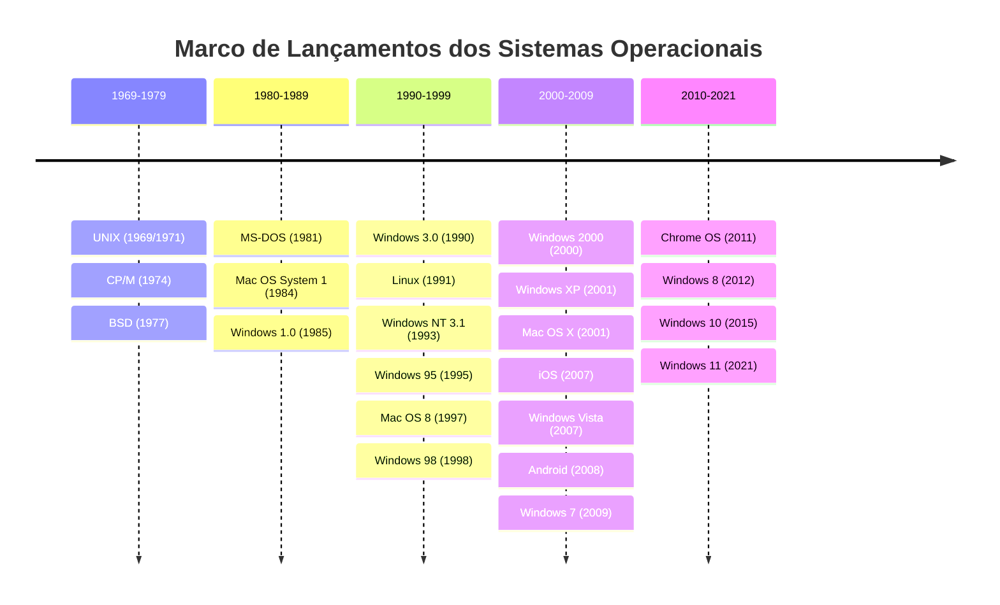

# Evolução dos Sistemas Operacionais: Uma Análise Cronológica e Estrutural

**Disciplina:** Fundamentos de Sistemas Operacionais  
**Tipo de documento:** Relatório técnico  
**Data:** Agosto de 2026  

---

## Resumo

Este relatório apresenta uma análise exaustiva da evolução histórica dos principais sistemas operacionais, desde o UNIX (1969/1971) até o Windows 11 (2021). A discussão é organizada em três representações complementares: (i) um **mapa mental**, que agrupa os sistemas por década de lançamento; (ii) um **fluxograma de descendência técnica e arquitetural**, que evidencia as relações de origem entre as duas grandes linhagens — UNIX e MS-DOS/Windows/NT; e (iii) um **gráfico de linha temporal**, que ilustra graficamente os lançamentos ao longo das décadas. Ao final, apresenta-se uma tabela de referência consolidada e devidamente fundamentada por referências bibliográficas acadêmicas.

---

## Sumário

1. [Introdução](#1-introdução)
2. [Mapa Mental — Organização por Década](#2-mapa-mental--organização-por-década)
3. [Fluxograma — Linhagens Técnicas e Arquiteturais](#3-fluxograma--linhagens-técnicas-e-arquiteturais)
4. [Linha do Tempo — Progressão Temporal](#4-linha-do-tempo--progressão-temporal)
5. [Tabela de Referência Consolidada](#5-tabela-de-referência-consolidada)
6. [Considerações Finais](#6-considerações-finais)
7. [Referências Bibliográficas](#7-referências-bibliográficas)

---

## 1. Introdução

A história dos sistemas operacionais modernos é compreendida fundamentalmente a partir de duas grande linhagens e paradigmas de desenvolvimento que se ramificaram ao longo de mais de cinco décadas:

- **Linhagem UNIX e POSIX-compliant**, iniciada em 1969/1971 no Bell Labs por Ken Thompson e Dennis Ritchie. Esta família deu origem ao BSD e ao Linux, servindo posteriormente de fundação técnica para o macOS, iOS, Android e Chrome OS.
- **Linhagem DOS e Windows NT**, iniciada conceitualmente com o CP/M (1974) e o MS-DOS (1981). Diferente de uma evolução estritamente linear, essa linhagem ramificou-se na linha de consumo baseada em MS-DOS (Windows 1.0 a 98/Me) e na linha corporativa **Windows NT** (desenvolvida do zero a partir de 1989 por Dave Cutler). Ambas convergem no **Windows XP (2001)**, estabelecendo a arquitetura NT como o núcleo padrão da Microsoft até o Windows 11 (2021).
- **A Trajetória Independente da Apple**, que iniciou em 1984 com o Mac OS System 1 em arquitetura proprietária e, no início dos anos 2000, realizou uma transição arquitetural profunda para o Mac OS X (baseado no kernel Darwin, derivado do BSD/NeXTSTEP), unindo-se à família UNIX.

As seções a seguir estruturam essa evolução através de abordagens hierárquicas, genealógicas e cronológicas.

---

## 2. Mapa Mental — Organização por Década

O diagrama a seguir agrupa os sistemas operacionais por década de lançamento, permitindo observar os períodos de maior efervescência e inovação tecnológica.

**Observação:** A década de 1990 destaca-se pela consolidação de sistemas operacionais de 32 bits, surgimento do kernel Linux e a dualidade entre a linha MS-DOS/Windows 9x e a arquitetura pura de 32 bits do Windows NT.

---

## 3. Fluxograma — Linhagens Técnicas e Arquiteturais

O fluxograma abaixo detalha as descendências técnicas exatas. A linhagem UNIX/Linux é destacada em tom verde e a linhagem DOS/Windows/NT em tom âmbar. Note-se a diferenciação histórica crucial entre a linha **MS-DOS/Windows 9x** e a linha **Windows NT**, bem como o ponto de unificação no **Windows XP**.

**Observação:** O Windows NT não deriva do código do MS-DOS ou do Windows 3.0; trata-se de um sistema projetado de forma autônoma para suporte multiprocessado, segurança avançada e portabilidade de arquitetura. O Windows XP descontinuou a arquitetura legada baseada em MS-DOS para usuários finais.

---

## 4. Linha do Tempo — Progressão Temporal

O diagrama a seguir representa a distribuição temporal dos lançamentos através de marcos cronológicos representativos por período.

---

## 5. Tabela de Referência Consolidada

| # | Sistema Operacional | Ano de Lançamento | Linhagem / Arquitetura | Modelo de Licenciamento / Código |
|---|---|---|---|---|
| 1 | UNIX | 1969/1971 | UNIX | Proprietário / Histórico |
| 2 | CP/M | 1974 | Digital Research (Pré-DOS) | Proprietário |
| 3 | BSD | 1977 | UNIX | Código Aberto (Licença BSD) |
| 4 | MS-DOS | 1981 | DOS | Proprietário / Código Fonte Aberto Histórico |
| 5 | Mac OS (System 1) | 1984 | Apple Clássico (Independente) | Proprietário |
| 6 | Windows 1.0 | 1985 | DOS (Interface Gráfica) | Proprietário |
| 7 | Windows 3.0 | 1990 | DOS (Ambiente Gráfico 16/32-bit) | Proprietário |
| 8 | Linux (Kernel) | 1991 | UNIX-like / POSIX | Código Aberto (GPLv2) |
| 9 | Windows NT 3.1 | 1993 | Windows NT (32-bit Puro) | Proprietário |
| 10 | Windows 95 | 1995 | MS-DOS / Windows 9x | Proprietário |
| 11 | Mac OS 8 | 1997 | Apple Clássico | Proprietário |
| 12 | Windows 98 | 1998 | MS-DOS / Windows 9x | Proprietário |
| 13 | Windows 2000 | 2000 | Windows NT (v5.0) | Proprietário |
| 14 | Windows XP | 2001 | Windows NT (v5.1) | Proprietário |
| 15 | Mac OS X | 2001 | UNIX (Darwin / BSD / Mach) | Proprietário (Núcleo Open Source) |
| 16 | iOS | 2007 | UNIX (Darwin / Mach) | Proprietário |
| 17 | Windows Vista | 2007 | Windows NT (v6.0) | Proprietário |
| 18 | Android | 2008 | UNIX (Kernel Linux) | Código Aberto (Apache / GPL) |
| 19 | Windows 7 | 2009 | Windows NT (v6.1) | Proprietário |
| 20 | Chrome OS | 2011 | UNIX (Kernel Linux) | Código Aberto / Proprietário |
| 21 | Windows 8 | 2012 | Windows NT (v6.2) | Proprietário |
| 22 | Windows 10 | 2015 | Windows NT (v10.0) | Proprietário |
| 23 | Windows 11 | 2021 | Windows NT (v10.0 / Build 22000+) | Proprietário |

---

## 6. Considerações Finais

A análise detalhada da evolução dos sistemas operacionais revela dois paradigmas fundamentais de sustentação da computação moderna:

1. **A Modularidade e Padronização UNIX/POSIX:** A filosofia Unix, fundamentada na criação de componentes pequenos, modulares e intercompatíveis, provou ser extraordinariamente adaptável. Ela permitiu que o núcleo original evoluísse desde computadores de de grande porte (mainframes) e estações de trabalho até supercomputadores (Linux) e dispositivos móveis de alta eficiência energética (Android e iOS).
2. **A Evolução da Arquitetura Windows NT:** A estratégia da Microsoft dividiu-se historicamente entre a rápida popularização dos computadores pessoais de 16/32 bits via MS-DOS/Windows 9x e a construção de um núcleo robusto e seguro de classe corporativa via Windows NT. A fusão executada no Windows XP provou ser um marco de engenharia de software, garantindo compatibilidade e estabilidade que perduram até as versões atuais (Windows 10 e 11).

Portanto, a computação contemporânea repousa solidamente sobre arquiteturas concebidas entre os anos 1970 e 1990, refinadas continuamente para atender às demandas de virtualização, mobilidade e computação em nuvem.

---

## 7. Referências Bibliográficas

- SILBERSCHATZ, Abraham; GALVIN, Peter Baer; GAGNE, Greg. **Operating System Concepts**. 10. ed. Hoboken: John Wiley & Sons, 2018.
- TANENBAUM, Andrew S.; BOS, Herbert. **Modern Operating Systems**. 4. ed. Upper Saddle River: Pearson, 2014.
- RITCHIE, Dennis M. The Development of the C Language. **ACM SIGPLAN Notices**, v. 28, n. 3, p. 201-208, 1993.
- RITCHIE, Dennis M.; THOMPSON, Ken. The UNIX Time-Sharing System. **Communications of the ACM**, v. 17, n. 7, p. 365-375, 1974.
- CUSTER, Helen. **Inside Windows NT**. Redmond: Microsoft Press, 1993.
- RUSSINOVICH, Mark E.; SOLOMON, David A.; IONESCU, Alex. **Windows Internals**: Including Windows 10 and Windows Server 2016. 7. ed. Redmond: Microsoft Press, 2017.
- TORVALDS, Linus; DIAMOND, David. **Just for Fun: The Story of an Accidental Revolutionary**. New York: HarperBusiness, 2001.
- MCKUSICK, Marshall Kirk; NEVILLE-NEIL, George V.; WATSON, Robert N. M. **The Design and Implementation of the FreeBSD Operating System**. 2. ed. Upper Saddle River: Addison-Wesley Professional, 2014.
- SINGH, Amit. **Mac OS X Internals: A Systems Approach**. Upper Saddle River: Addison-Wesley Professional, 2006.
