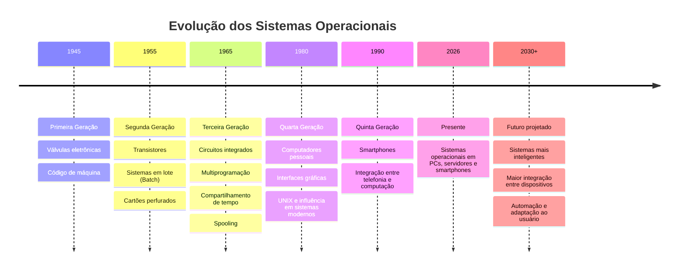
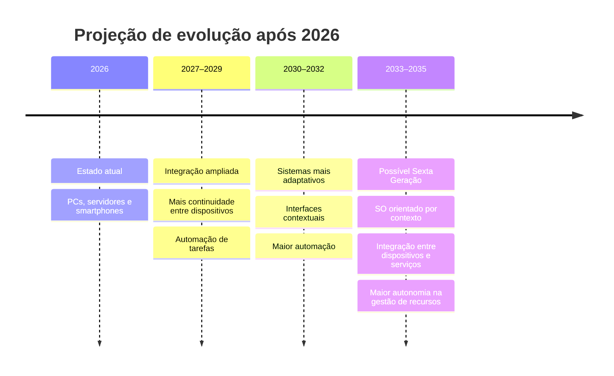

# Linha do Tempo — Evolução dos Sistemas Operacionais

> **Documento profissional e interativo**  
> **Base:** material fornecido em PDF  
> **Objetivo:** apresentar a evolução histórica dos sistemas operacionais, destacando mudanças tecnológicas e projetando possíveis características futuras.

---

## 1. Visão geral

A evolução dos sistemas operacionais acompanha a transformação do próprio computador: de máquinas grandes, caras e pouco acessíveis para plataformas pessoais, servidores e dispositivos móveis.

A linha do tempo abaixo organiza as principais etapas apresentadas no material, permitindo navegar entre os períodos e consultar os principais avanços de cada geração.

> **Nota metodológica:** os acontecimentos históricos abaixo são derivados do material fornecido. A seção **Previsão de Futuro** é uma projeção interpretativa, construída a partir dos padrões de evolução apresentados no documento, e não uma afirmação factual sobre o futuro.

---

## 2. Linha do tempo interativa



---

## 3. Detalhamento por geração

<details>
<summary><strong>🔴 1945–1955 — Primeira Geração</strong></summary>

### Tecnologia principal
- Válvulas eletrônicas.

### Características
- Computadores muito grandes.
- Alto custo.
- Alto consumo de energia.
- Muitas falhas.
- Programação diretamente em código de máquina.
- Em alguns casos, era necessário alterar conexões físicas ou painéis da máquina para programar.

**Referência indicada no material:** Tanenbaum; Bos (2015).

</details>

<details>
<summary><strong>🟠 1955–1965 — Segunda Geração</strong></summary>

### Tecnologia principal
- Transistores.

### Principais avanços
- Maior confiabilidade.
- Computadores menores e mais rápidos.
- Maior viabilidade para uso comercial.
- Surgimento dos sistemas em lote (**Batch**).
- Programas e dados eram preparados antecipadamente.
- Uso de cartões perfurados para entrada de programas e dados.

**Referência indicada no material:** Tanenbaum; Bos (2015).

</details>

<details>
<summary><strong>🟡 1965–1980 — Terceira Geração</strong></summary>

### Tecnologia principal
- Circuitos integrados.

### Principais avanços
- Computadores mais compactos e potentes.
- Sistemas operacionais mais complexos e eficientes.
- **Multiprogramação:** vários programas podiam permanecer na memória simultaneamente.
- **Compartilhamento de tempo:** vários usuários podiam utilizar o sistema por meio de terminais.
- **Spooling:** armazenamento temporário de dados de entrada e saída em disco, aumentando a eficiência.

**Referência indicada no material:** Tanenbaum; Bos (2015).

</details>

<details>
<summary><strong>🟢 1980–presente — Quarta Geração</strong></summary>

### Principais mudanças
- Popularização dos computadores pessoais.
- Maior preocupação com facilidade de uso.
- Expansão das interfaces gráficas.
- Substituição progressiva de comandos textuais por elementos visuais.

### Influência do UNIX
O material destaca o UNIX como uma alternativa mais simples ao MULTICS e como uma forte influência sobre sistemas modernos, incluindo **Linux, macOS e Android**.

Os sistemas operacionais atuais estão presentes em:
- computadores pessoais;
- servidores;
- smartphones.

**Referência indicada no material:** Tanenbaum; Bos (2015).

</details>

<details>
<summary><strong>🔵 1990–presente — Quinta Geração</strong></summary>

### Integração entre telefonia e computação

O material apresenta a evolução dos smartphones como um marco dessa geração.

Segundo o documento:
- a ideia de combinar telefonia e computação já existia desde a década de 1970;
- em meados da década de 1990, a Nokia lançou o N9000, combinando telefone e PDA;
- em 1997, a Ericsson utilizou o termo **smartphone** para o modelo Penelope GS88.

### Significado na evolução

A computação deixa de estar restrita ao computador tradicional e passa a acompanhar o usuário em dispositivos móveis.

</details>

---

## 4. Marcos de transformação

| Período | Transformação | Resultado |
|---|---|---|
| 1945–1955 | Válvulas → processamento eletrônico | Primeiros computadores de grande porte |
| 1955–1965 | Transistores | Maior confiabilidade e redução de tamanho |
| 1965–1980 | Circuitos integrados | Mais potência e sistemas mais eficientes |
| 1965–1980 | Multiprogramação | Melhor aproveitamento da CPU |
| 1965–1980 | Compartilhamento de tempo | Uso simultâneo por vários usuários |
| 1965–1980 | Spooling | Maior eficiência de entrada e saída |
| 1980–presente | Computadores pessoais + interfaces gráficas | Maior acessibilidade |
| 1990–presente | Telefonia + computação | Expansão dos smartphones |

---

## 5. Padrão observado na evolução

A partir do conteúdo do material, é possível observar uma sequência de tendências:

```text
MAIOR PORTE
    ↓
MAIOR CONFIABILIDADE
    ↓
MENOR TAMANHO
    ↓
MAIOR VELOCIDADE
    ↓
MAIOR EFICIÊNCIA
    ↓
MULTIPROGRAMAÇÃO
    ↓
USO COMPARTILHADO
    ↓
INTERFACE GRÁFICA
    ↓
MOBILIDADE
    ↓
INTEGRAÇÃO ENTRE DISPOSITIVOS
    ↓
[ PRÓXIMA ETAPA — PROJEÇÃO ]
```

Esse padrão sugere que a evolução não ocorre apenas pelo aumento do poder computacional. Ela também envolve **redução de barreiras para o usuário, integração, eficiência e ampliação dos ambientes em que o sistema operacional pode atuar**.

---

# 6. 🔮 Previsão do futuro

## 6.1 Possível próxima etapa: sistemas operacionais inteligentes

O material encerra questionando quais poderiam ser as características de uma próxima geração de sistemas operacionais e introduz o conceito de **Sexta Geração**.

A partir dos padrões históricos apresentados, uma **projeção possível** é que os próximos sistemas operacionais avancem principalmente em direção à adaptação automática ao contexto do usuário.

### Horizonte projetado



> **Importante:** as etapas de 2027 em diante são **previsões**, não informações presentes no PDF.

---

## 6.2 Características que podem marcar a próxima geração

### 🤖 1. Inteligência integrada ao sistema operacional

O sistema operacional poderá deixar de apenas executar comandos e passar a interpretar melhor o contexto das atividades do usuário.

**Possível consequência:** tarefas repetitivas poderiam ser automatizadas com menor intervenção manual.

---

### 🔗 2. Integração contínua entre dispositivos

A evolução dos computadores pessoais para smartphones sugere uma tendência de integração cada vez maior.

**Projeção:** o sistema operacional poderá funcionar como uma camada comum entre computador, smartphone, dispositivos domésticos, veículos e outros equipamentos conectados.

---

### 🧠 3. Adaptação ao contexto

Em vez de oferecer sempre a mesma interface, um futuro sistema operacional poderá adaptar recursos conforme:
- dispositivo utilizado;
- atividade realizada;
- ambiente;
- necessidade do usuário;
- recursos disponíveis.

---

### ⚙️ 4. Gerenciamento automático de recursos

Outra possível evolução é o gerenciamento cada vez mais automático de:
- processamento;
- memória;
- armazenamento;
- conectividade;
- energia;
- execução de aplicações.

---

### 🛡️ 5. Segurança mais integrada

A segurança tende a deixar de ser apenas uma camada adicional e poderá fazer parte do funcionamento cotidiano do sistema.

**Projeção:** identificação de comportamentos incomuns, isolamento automático de processos suspeitos e proteção mais contextualizada.

---

## 7. Cenário projetado para 2035

> **Cenário hipotético — não apresentado como fato no material.**

Imagine um usuário iniciando uma atividade em um smartphone e continuando automaticamente no computador. O sistema reconhece o contexto, organiza os recursos necessários, sincroniza os dados e ajusta a interface ao dispositivo utilizado.

Ao mesmo tempo, processos em segundo plano podem ser reorganizados automaticamente para reduzir consumo de energia e melhorar desempenho.

Nesse cenário, o sistema operacional deixa de ser percebido apenas como uma plataforma que "abre programas" e passa a funcionar como uma **camada inteligente de coordenação entre usuário, aplicações e dispositivos**.

---

## 8. Comparação: passado × presente × futuro

| Aspecto | Primeiras gerações | Presente | Futuro projetado |
|---|---|---|---|
| Interação | Código de máquina / painéis | Interfaces gráficas | Interfaces contextuais e adaptativas |
| Computação | Grandes máquinas | PCs, servidores e smartphones | Ecossistema de dispositivos integrados |
| Programação | Baixo nível | Diversas linguagens e ferramentas | Maior automação |
| Recursos | Limitados e caros | Elevada capacidade | Gerenciamento cada vez mais automático |
| Mobilidade | Praticamente inexistente | Smartphones | Continuidade entre dispositivos |
| Usuários | Operadores especializados | Público amplo | Experiência cada vez mais personalizada |
| Sistema operacional | Controlava recursos básicos | Gerencia ambientes complexos | Poderá coordenar ambientes distribuídos e inteligentes |

---

## 9. Conclusão

A história apresentada mostra uma transformação progressiva:

**válvulas → transistores → circuitos integrados → computadores pessoais → smartphones → possível nova geração de sistemas inteligentes.**

Cada etapa ampliou a capacidade dos computadores e, ao mesmo tempo, tornou a tecnologia mais acessível, eficiente e integrada.

A principal hipótese para o futuro é que a próxima geração de sistemas operacionais poderá avançar não apenas em **potência**, mas principalmente em **integração, automação, adaptação e inteligência**.

Essa projeção deve ser entendida como uma interpretação baseada nos padrões históricos apresentados no material, e não como uma previsão certa.

---

## 10. Referência do material

**TANENBAUM; BOS (2015)** — referência bibliográfica indicada no material fornecido.

Outras fontes mencionadas no documento:
- lasdpc.icmc.usp.br
- computerstory.weebly.com
- historiadainformatica2013.weebly.com
- ResearchGate

