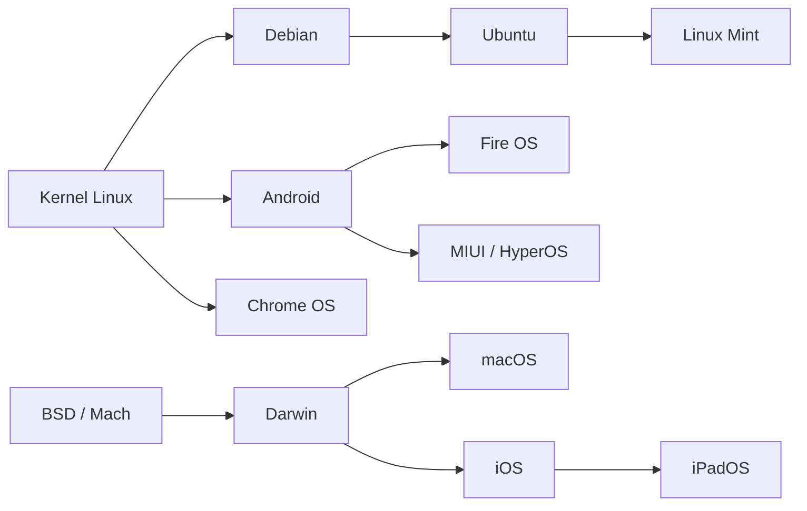

# 🖥️ Sistemas Operacionais Derivados de Outros Sistemas

---

## 📑 Índice
1. [Introdução](#-introdução)
2. [Sistemas Operacionais Pesquisados](#-sistemas-operacionais-pesquisados)
3. [Mapa de Derivação](#-mapa-de-derivação)
4. [Tabela Comparativa](#-tabela-comparativa)
5. [Conclusão](#-conclusão)

---

## 📖 Introdução

Diversos sistemas operacionais utilizados atualmente **não foram criados totalmente do zero**: eles foram desenvolvidos a partir do kernel, da arquitetura ou da estrutura de um sistema operacional já existente. Essa prática permite reaproveitar código estável, testado e mantido por uma grande comunidade, reduzindo o tempo de desenvolvimento e aumentando a compatibilidade com hardware e software já existentes.

> [!NOTE]
> A seguir são apresentados **8 sistemas operacionais entre os mais utilizados no mundo**, todos construídos a partir de outro sistema operacional, indicando qual foi sua base.

---

## 🔎 Sistemas Operacionais Pesquisados

<strong>1. Android</strong> — baseado no kernel Linux

O Android, desenvolvido pelo Google, é o sistema operacional mais usado do mundo em dispositivos móveis. Utiliza o kernel Linux como base, porém modificado (Binder IPC, gerenciamento de energia para dispositivos móveis, Android Runtime/ART). Sobre esse kernel, o Google construiu uma camada própria de aplicações, bibliotecas e um runtime para apps escritos majoritariamente em Java/Kotlin.

<strong>2. macOS</strong> — baseado no Darwin/BSD

O macOS, da Apple, é construído sobre o Darwin, sistema de código aberto baseado em componentes do BSD (Berkeley Software Distribution) e no microkernel Mach. A Apple adiciona a interface gráfica proprietária (Aqua), frameworks próprios (Cocoa) e serviços exclusivos do ecossistema Apple.

<strong>3. iPadOS</strong> — baseado no iOS/Darwin

Derivado do iOS, que também é baseado no Darwin (mesma base do macOS). A Apple adaptou o sistema para telas maiores, com multitarefa em janelas, suporte a mouse/trackpad e Apple Pencil, mantendo o mesmo núcleo do iPhone.

<strong>4. Ubuntu</strong> — baseado no Debian

Uma das distribuições Linux mais populares do mundo, desenvolvida pela Canonical a partir do Debian GNU/Linux. Reaproveita o gerenciador de pacotes `.deb` (APT/dpkg) e a estrutura do Debian, adicionando ciclo de lançamentos mais curto, foco em facilidade de uso e suporte comercial.

<strong>5. Linux Mint</strong> — baseado no Ubuntu (→ Debian)

Uma das distribuições desktop mais usadas por usuários domésticos, construída a partir do Ubuntu. Mantém compatibilidade `.deb`/APT, mas propõe ambiente gráfico próprio (Cinnamon), mais codecs multimídia pré-instalados e visual mais tradicional.

<strong>6. Chrome OS</strong> — baseado no kernel Linux / Gentoo

Amplamente usado em notebooks Chromebook, populares em escolas. Utiliza o kernel Linux, inicialmente estruturado sobre ferramentas do Gentoo Linux. O Google construiu um sistema simplificado, voltado ao navegador Chrome e apps web, com forte integração à nuvem.

<strong>7. Fire OS</strong> — baseado no Android

Sistema da Amazon usado nos tablets Fire e nos dispositivos Fire TV. Construído sobre o Android (já baseado em Linux), porém sem os serviços do Google, substituídos pela loja de apps e serviços próprios da Amazon.

<strong>8. MIUI / HyperOS</strong> — baseado no Android

Camada de personalização da Xiaomi sobre o Android, presente em um dos maiores volumes de smartphones vendidos no mundo. Mantém o núcleo Linux/Android, adicionando interface própria, otimizações de bateria/desempenho e integração com o ecossistema IoT da Xiaomi.

---

## 🗺️ Mapa de Derivação

---

## 📊 Tabela Comparativa

| Sistema Operacional | Base Utilizada | Principais Diferenças em Relação à Base |
|---|---|---|
| **Android** | Kernel Linux | Kernel modificado (Binder IPC, gerenciamento de energia mobile); camada de aplicações e runtime próprios (ART); voltado a dispositivos móveis/touch |
| **macOS** | Darwin / BSD / Mach | Interface gráfica proprietária (Aqua); frameworks fechados (Cocoa); fortemente integrado ao hardware Apple |
| **iPadOS** | iOS / Darwin | Interface adaptada para telas maiores; multitarefa em janelas; suporte a mouse/trackpad e Apple Pencil |
| **Ubuntu** | Debian GNU/Linux | Ciclo de lançamentos mais curto e previsível; foco em facilidade de uso; suporte comercial da Canonical; repositórios próprios |
| **Linux Mint** | Ubuntu (→ Debian) | Ambiente gráfico próprio (Cinnamon, MATE); mais codecs multimídia inclusos; visual mais tradicional |
| **Chrome OS** | Kernel Linux / Gentoo | Extremamente simplificado; foco em navegador e apps web; forte dependência da nuvem; pouca personalização |
| **Fire OS** | Android | Remoção dos serviços do Google; loja de apps e serviços próprios da Amazon; foco em tablets e streaming |
| **MIUI / HyperOS** | Android | Interface visual própria; otimizações exclusivas de bateria/desempenho; integração com ecossistema IoT da Xiaomi |

---

## 🎯 Conclusão

A pesquisa mostra que boa parte dos sistemas operacionais mais utilizados atualmente não foi criada do zero, mas sim construída sobre kernels e estruturas já consolidadas. Isso é especialmente evidente no ecossistema **Android**, que serve de base para sistemas próprios de fabricantes (Fire OS, MIUI/HyperOS), e no ecossistema **Linux**, que sustenta desde distribuições desktop (Ubuntu, Linux Mint) até sistemas voltados à nuvem (Chrome OS). Esse reaproveitamento acelera o desenvolvimento e aproveita a maturidade e estabilidade de sistemas já testados por grandes comunidades e empresas.
