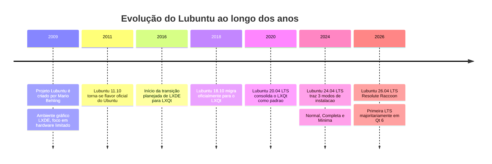
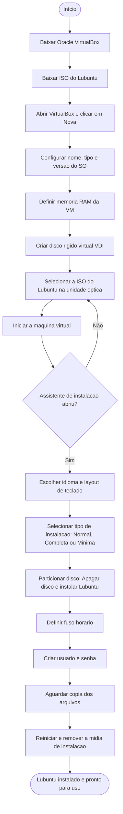

# 🐧 Manual de Instalação do Lubuntu no Oracle VirtualBox

  

> Documento no estilo Markdown, com visual moderno inspirado em documentação técnica *dark mode*, blocos destacados e checklist de progresso.

---

## 🟢 Status do Guia

| Documento | Última atualização | Versão do manual |
|---|---|---|
| 🟢 Ativo | 31/08/2026 | v1.2 (auditado) |

> 💡 **Dica de leitura**
> Este arquivo `.md` foi pensado para ser lido em um visualizador Markdown com suporte a **Mermaid** (GitHub, GitLab, Obsidian, VS Code, Typora). Se o seu leitor não renderizar os diagramas, eles ainda aparecerão como blocos de código legíveis. As imagens usam caminhos relativos — mantenha a pasta `imagens/` no mesmo diretório deste arquivo.

---

## 📑 Sumário

1. [Visão Geral](#1-visao-geral)
2. [Um Pouco de História do Lubuntu](#2-historia-lubuntu)
3. [Linha do Tempo do Lubuntu](#3-linha-do-tempo)
4. [Principais Recursos do Lubuntu](#4-principais-recursos)
5. [Pré-requisitos](#5-pre-requisitos)
6. [Fluxograma do Processo de Instalação](#6-fluxograma)
7. [Passo a Passo da Instalação](#7-passo-a-passo)
8. [Checklist do Projeto de Instalação](#8-checklist)
9. [Dicas e Boas Práticas](#9-dicas-boas-praticas)

---

<a id="1-visao-geral"></a>
## 1. Visão Geral

Este manual ensina, passo a passo, como instalar o **Lubuntu** dentro de uma máquina virtual usando o **Oracle VirtualBox**. Além do passo a passo técnico, você vai encontrar um pouco da **história** da distribuição, uma **linha do tempo** com seus principais marcos, os **principais recursos**, um **fluxograma** do processo completo de instalação e uma **ambientação visual** com o Gerenciador do VirtualBox.

---

<a id="2-historia-lubuntu"></a>
## 2. 📜 Um Pouco de História do Lubuntu

O **Lubuntu** nasceu em **2009**, idealizado por **Mario Behling**, com o objetivo de criar uma variante *(flavor)* oficial do Ubuntu voltada para **computadores mais antigos ou com hardware limitado**, sem abrir mão de uma boa experiência de uso.

- Nos primeiros anos, o Lubuntu usava o **LXDE** como ambiente gráfico — um dos ambientes mais leves do mundo Linux na época.
- Em **2018**, a partir da versão **18.10**, o projeto migrou oficialmente para o **LXQt**, unindo a leveza do LXDE com a base em **Qt**, mais moderna e mantida ativamente.
- Ao longo dos anos, o Lubuntu se firmou como **flavor oficial do Ubuntu**, herdando a base de pacotes, repositórios e ciclo de lançamentos da Canonical, mas com foco em **desempenho e simplicidade**.
- A versão mais recente é o **Lubuntu 26.04 LTS ("Resolute Raccoon")**, lançada em abril de 2026 — a primeira versão LTS do Lubuntu construída sobre um ambiente **majoritariamente baseado em Qt 6**, trazendo aplicativos com visual mais moderno e um novo menu de aplicações ("Fancy Menu").

Hoje, o Lubuntu é considerado um dos **flavors mais leves do ecossistema Ubuntu**, sendo indicado para notebooks antigos, máquinas virtuais e usuários que priorizam desempenho.

---

<a id="3-linha-do-tempo"></a>
## 3. 🕰️ Linha do Tempo do Lubuntu



> 🕓 A linha do tempo acima resume os marcos mais importantes da distribuição, da criação em 2009 até a versão LTS mais recente.

---

<a id="4-principais-recursos"></a>
## 4. ⚙️ Principais Recursos do Lubuntu

| Recurso | Descrição |
|---|---|
| 🪶 **Leveza** | Baixo consumo de RAM e CPU, ideal para hardware limitado ou máquinas virtuais. |
| 🖥️ **Ambiente LXQt** | Interface simples, rápida e personalizável, com visual moderno em Qt 6. |
| 📦 **Base Ubuntu** | Acesso completo aos repositórios `apt` e pacotes `snap` do ecossistema Ubuntu. |

- ✅ Instalador gráfico com modos **Normal**, **Completo** e **Mínimo**
- ✅ Conjunto enxuto de aplicativos pré-instalados (sem excessos)
- ✅ Suporte LTS de 3 anos nas versões *Long Term Support*
- ✅ Totalmente gratuito e de código aberto (licença GPL)
- ✅ Compatível com arquitetura x86-64

---

<a id="5-pre-requisitos"></a>
## 5. 📋 Pré-requisitos

> ℹ️ Os itens abaixo refletem o ambiente de exemplo usado neste guia. Use a seção [8. Checklist](#8-checklist) para acompanhar o seu próprio progresso.

- [x] Computador host com pelo menos **4 GB de RAM livres** (recomendado 8 GB+)
- [x] Pelo menos **20 GB de espaço em disco** livres
- [x] **Oracle VirtualBox** instalado ([virtualbox.org](https://www.virtualbox.org/))
- [x] Imagem `.iso` do **Lubuntu** baixada ([lubuntu.me/downloads](https://lubuntu.me/downloads/))
- [ ] Virtualização (VT-x/AMD-V) habilitada na BIOS/UEFI

---

<a id="6-fluxograma"></a>
## 6. 🔀 Fluxograma do Processo de Instalação



---

<a id="7-passo-a-passo"></a>
## 7. 🛠️ Passo a Passo da Instalação

### Etapa 1 — Baixar e instalar o Oracle VirtualBox

```bash
# No Linux (Ubuntu/Debian), via terminal:
sudo apt update
sudo apt install virtualbox
```

> No Windows/macOS, baixe o instalador diretamente em [virtualbox.org/wiki/Downloads](https://www.virtualbox.org/wiki/Downloads) e siga o assistente padrão de instalação.

### Etapa 2 — Baixar a ISO do Lubuntu

Acesse [lubuntu.me/downloads](https://lubuntu.me/downloads/) e baixe a versão desejada (recomendado: a versão **LTS** mais recente).

### Etapa 3 — Criar a Máquina Virtual

1. Abra o VirtualBox e clique em **"Nova"**.
2. Dê um nome à VM (ex.: `Lubuntu-VM`).
3. Em **Tipo**, selecione `Linux`; em **Versão**, selecione `Ubuntu (64-bit)`.
4. Defina a quantidade de **memória RAM** (mínimo 1 GB, recomendado 2 GB ou mais).
5. Crie um **disco rígido virtual** novo, formato `VDI`, tamanho dinamicamente alocado, com pelo menos **20 GB**.

### Etapa 3.1 — 🧭 Ambientação: Conhecendo o Gerenciador do VirtualBox

Antes de seguir para a próxima etapa, vale se ambientar com a tela principal do **Oracle VirtualBox Gerenciador**, pois é nela que você vai passar boa parte do tempo configurando e ligando a VM.


| Área da interface | O que representa |
|---|---|
| **Barra de ferramentas** (Novo / Open / Configurações / Descartar / Exibir) | Ações principais: criar uma nova VM, abrir uma existente, editar configurações, descartar o estado atual ou exibir a janela da VM em execução. |
| **Lista de máquinas** (lateral esquerda) | Mostra todas as VMs cadastradas — no exemplo, a `Lubuntu` aparece com o status **"Executado"**. |
| **Aba "Detalhes"** | Resumo completo da configuração da VM selecionada. |
| **Bloco "Geral"** | Nome da VM e o tipo/versão do sistema operacional identificado (ex.: `Ubuntu 25.04 (Plucky Puffin) (64-bit)`). |
| **Bloco "Sistema"** | Memória RAM alocada, número de processadores virtuais, ordem de boot e recursos de aceleração (paginação aninhada, KVM). |
| **Bloco "Tela"** | Memória de vídeo, controladora gráfica e opções de gravação/desktop remoto. |
| **Bloco "Armazenamento"** | Mostra a **ISO anexada** (controladora IDE) e o **disco virtual `.vdi`** (controladora SATA) — é aqui que você confirma se a imagem do Lubuntu foi montada corretamente. |
| **Painel "Pré-Visualização"** | Uma miniatura ao vivo da tela da VM, útil para acompanhar o progresso sem precisar abrir a janela inteira. |

> 💡 **Dica:** sempre confira o bloco **Armazenamento** antes de iniciar a VM — é o erro mais comum: esquecer de anexar a ISO ou anexá-la na controladora errada.

> ⚠️ **Observação:** é normal o bloco **Geral** exibir um SO **diferente** do da ISO anexada (ex.: `Ubuntu 25.04` detectado com uma ISO `lubuntu-26.04`). O VirtualBox tenta adivinhar o sistema pelo nome do arquivo/heurística interna *antes* da instalação — isso não afeta a instalação e pode ser corrigido depois em **Configurações → Geral → Versão**, se desejado.

### Etapa 4 — Anexar a ISO e iniciar a instalação

1. Com a VM selecionada, vá em **Configurações → Armazenamento**.
2. Clique no ícone de disco vazio (unidade óptica) e selecione **"Escolher um arquivo de disco"**.
3. Selecione a ISO do Lubuntu baixada na Etapa 2.
4. Clique em **"Iniciar"** para ligar a máquina virtual.

### Etapa 5 — Assistente de instalação do Lubuntu


> A imagem acima mostra a **tela de boas-vindas** do instalador do Lubuntu 26.04 "Resolute Raccoon" já em execução dentro do Oracle VirtualBox. É nela que você escolhe o idioma antes de avançar pelas próximas etapas do assistente.

1. Escolha o **idioma** e o **layout do teclado**.
2. Selecione o tipo de instalação: **Normal**, **Completa** ou **Mínima**.
3. Em **Tipo de instalação**, escolha **"Apagar disco e instalar Lubuntu"** (isso afeta apenas o disco virtual, não o seu computador real).
4. Defina o **fuso horário**.
5. Crie o **nome de usuário** e a **senha**.
6. Aguarde a cópia dos arquivos — o processo pode levar de 10 a 20 minutos, dependendo do hardware do host.

### Etapa 6 — Finalização

1. Ao concluir, o instalador solicitará **reiniciar o sistema**.
2. Remova a ISO da unidade virtual (**Dispositivos → Unidades de Óptico → Remover disco**) antes de reiniciar, para não abrir o instalador novamente.
3. Faça login com o usuário criado — sua instalação do Lubuntu está pronta!

---

<a id="8-checklist"></a>
## 8. ✅ Checklist do Projeto de Instalação

**Progresso: 0 de 7 concluídos**

- [ ] VirtualBox instalado no computador host
- [ ] ISO do Lubuntu baixada
- [ ] Máquina virtual criada e configurada
- [ ] Ambientação com o Gerenciador do VirtualBox realizada
- [ ] ISO anexada e VM iniciada
- [ ] Instalação do Lubuntu concluída dentro da VM
- [ ] Primeiro login realizado com sucesso

---

<a id="9-dicas-boas-praticas"></a>
## 9. 🔒 Dicas e Boas Práticas

> **Desempenho:** ative os **Adições de Convidado (Guest Additions)** do VirtualBox após a instalação, para melhorar resolução de tela, integração de mouse e compartilhamento de arquivos.

> **Snapshots:** antes de instalar programas ou fazer alterações grandes, crie um **snapshot** da VM (`Máquina → Fazer snapshot`) para poder reverter facilmente.

> **Virtualização na BIOS:** se o VirtualBox travar ao iniciar a VM, verifique se a virtualização (Intel VT-x / AMD-V) está habilitada na BIOS/UEFI do computador.

---

## 🗂️ Histórico de Revisões

| Versão | Alterações |
|---|---|
| v1.0 | Versão inicial: visão geral, história, recursos, pré-requisitos, fluxograma e passo a passo. |
| v1.0.1 | Adição da captura de tela da Etapa 5 (tela de boas-vindas do instalador). |
| v1.0.2 | Adição da linha do tempo e da ambientação com o Gerenciador do VirtualBox (com captura de tela). |
| v1.1 | **Auditoria de código:** conversão de tabela HTML para Markdown nativo, correção de links sem hiperlink, padronização de rótulos do fluxograma Mermaid (remoção de aspas/caracteres que podem quebrar a renderização), inclusão de Sumário navegável, renumeração da etapa de ambientação (3.1) e atualização do cabeçalho de status. |
| **v1.2** | **Auditoria profissional:** âncoras do Sumário trocadas por IDs HTML explícitos (os emojis nos títulos geravam slugs com hífen duplo e quebravam os links em GitHub/GitLab); correção do cabeçalho de tabela "Servidor" → "Documento" (resíduo de outro template); troca do ícone `logo=lubuntu` (inexistente no catálogo Simple Icons, badge ficaria sem ícone) por `logo=linux`; inclusão de nota explicando a divergência de SO detectado vs. ISO anexada na captura da Etapa 3.1; esclarecimento de que a seção 5 reflete o ambiente de exemplo, não o progresso do leitor (ver Checklist, seção 8). |

---

*Manual de Instalação do Lubuntu no Oracle VirtualBox — Documento em Markdown*
