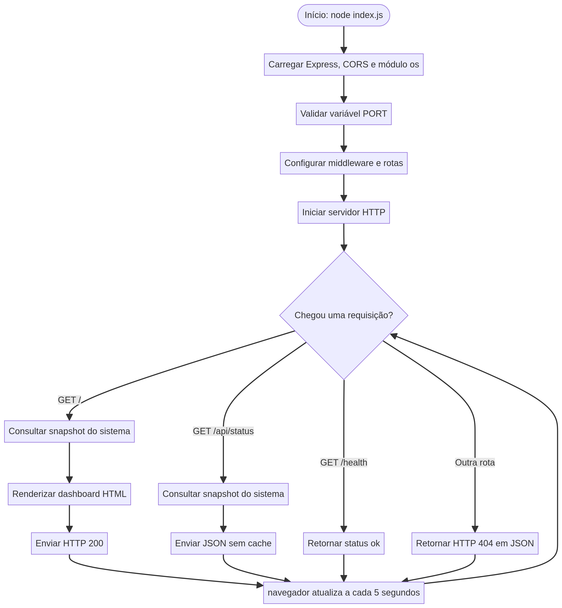
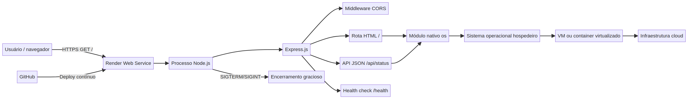

# cloud-so-app

Dashboard Express.js para consultar informações do sistema operacional que executa o processo Node.js.

> **Documento principal do trabalho:** consulte o [Manual técnico completo](MANUAL.md) para seguir todo o passo a passo de instalação, desenvolvimento, testes, GitHub, Render, comparação local/cloud e análise de Sistemas Operacionais.

## Recursos

- Dashboard HTML responsivo com atualização automática a cada 5 segundos.
- API JSON em `/api/status`.
- Health check em `/health`.
- Hostname, plataforma, arquitetura, CPUs lógicas, uso real de CPU e uptime.
- Memória total/livre do sistema e memória consumida pelo processo Node.js.
- CORS com múltiplas origens separadas por vírgula em `CORS_ORIGIN`.
- `Cache-Control: no-store` para evitar métricas obsoletas.
- Tratamento de 404 e erro interno em JSON.
- Desativação do cabeçalho `X-Powered-By`.
- Encerramento gracioso para `SIGTERM` e `SIGINT`.
- Diagramas Mermaid no diretório `docs`.
- Modelo de configuração em `.env.example` para `PORT` e `CORS_ORIGIN`.

## Execução

```bash
npm install
npm run check
npm start
```

Abra `http://localhost:3000/`.

Para configurar variáveis localmente, copie o modelo:

```bash
cp .env.example .env
```

O Node.js não carrega arquivos `.env` automaticamente por padrão; defina as variáveis no terminal, em uma ferramenta de desenvolvimento ou na configuração do Render.

Para desenvolvimento com reinício automático:

```bash
npm run dev
```

Para validar a sintaxe:

```bash
npm run check
```

## Endpoints

| Método | Endpoint | Finalidade |
|---|---|---|
| GET | `/` | Dashboard HTML acessível |
| GET | `/api/status` | Snapshot JSON do sistema |
| GET | `/health` | Verificação de disponibilidade |
| qualquer | outra rota | Erro `404` em JSON |

## Render

- **Build Command:** `npm install`
- **Start Command:** `npm start`
- A aplicação respeita a variável `PORT` fornecida pela plataforma.

### CORS por ambiente

Por padrão, o desenvolvimento local permite qualquer origem. Em produção, configure uma origem específica:

```bash
CORS_ORIGIN=https://frontend.exemplo.com npm start
```

No Render, defina `NODE_ENV=production` e `CORS_ORIGIN` nas variáveis de ambiente do serviço. Para permitir mais de uma origem, separe os endereços por vírgula, por exemplo `https://site1.com,https://site2.com`. A aplicação remove espaços extras e compara cada origem recebida com a lista permitida. Em desenvolvimento, uma `CORS_ORIGIN` vazia permite qualquer origem (`*`); em produção, a ausência de uma origem explícita bloqueia o CORS.

## Diagramas

- [Mapa mental](docs/mapa-mental.mmd)
- [Fluxograma](docs/fluxograma.mmd)
- [Arquitetura](docs/arquitetura.mmd)
- [Manual técnico completo](MANUAL.md)

Os arquivos-fonte Mermaid (`.mmd`) e as imagens PNG correspondentes estão versionados em `docs/` para facilitar a entrega acadêmica.

### Mapa mental


### Fluxograma de execução



### Arquitetura em cloud


