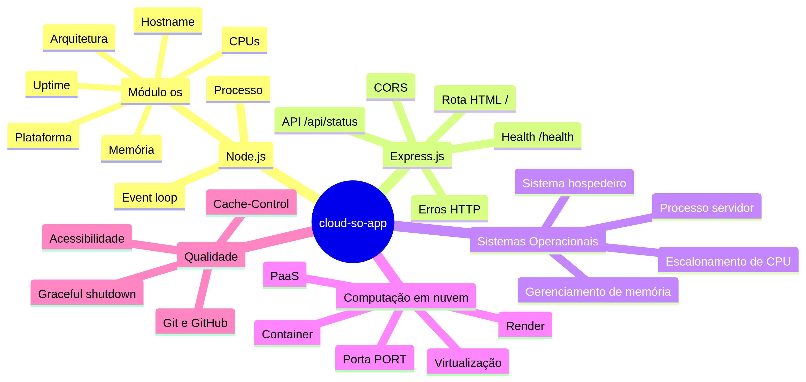

# cloud-so-app

Dashboard Express.js para consultar informações do sistema operacional que executa o processo Node.js.

## Recursos

- Dashboard HTML responsivo com atualização automática a cada 5 segundos.
- API JSON em `/api/status`.
- Health check em `/health`.
- Hostname, plataforma, arquitetura, CPUs lógicas, memória e uptime.
- CORS configurado para consumo por frontends separados.
- CORS restrito por `CORS_ORIGIN` quando a variável estiver definida e aberto apenas como fallback de desenvolvimento.
- `Cache-Control: no-store` para evitar métricas obsoletas.
- Tratamento de 404 e erro interno em JSON.
- Desativação do cabeçalho `X-Powered-By`.
- Encerramento gracioso para `SIGTERM` e `SIGINT`.
- Diagramas Mermaid no diretório `docs/diagrams`.

## Execução

```bash
npm install
npm start
```

Abra `http://localhost:3000/`.

Para desenvolvimento com reinício automático:

```bash
npm run dev
```

Para validar a sintaxe:

```bash
npm run check
```

## Endpoints

| Método | Endpoint | Finalidade |
|---|---|---|
| GET | `/` | Dashboard HTML acessível |
| GET | `/api/status` | Snapshot JSON do sistema |
| GET | `/health` | Verificação de disponibilidade |
| qualquer | outra rota | Erro `404` em JSON |

## Render

- **Build Command:** `npm install`
- **Start Command:** `npm start`
- A aplicação respeita a variável `PORT` fornecida pela plataforma.

### CORS por ambiente

Por padrão, o desenvolvimento local permite qualquer origem. Em produção, configure uma origem específica:

```bash
CORS_ORIGIN=https://frontend.exemplo.com npm start
```

No Render, defina `CORS_ORIGIN` nas variáveis de ambiente do serviço. O valor deve conter a origem completa, incluindo protocolo e porta quando aplicável, por exemplo `https://frontend.exemplo.com`.

## Diagramas

- [Mapa mental](docs/diagrams/mapa-mental.mmd)
- [Fluxograma](docs/diagrams/fluxograma.mmd)
- [Arquitetura](docs/diagrams/arquitetura.mmd)
- [Auditoria profissional](AUDITORIA.md)

Os arquivos-fonte Mermaid (`.mmd`) e as imagens PNG correspondentes estão versionados em `docs/diagrams/` para facilitar a entrega acadêmica.

### Mapa mental



### Fluxograma de execução


### Arquitetura em cloud


